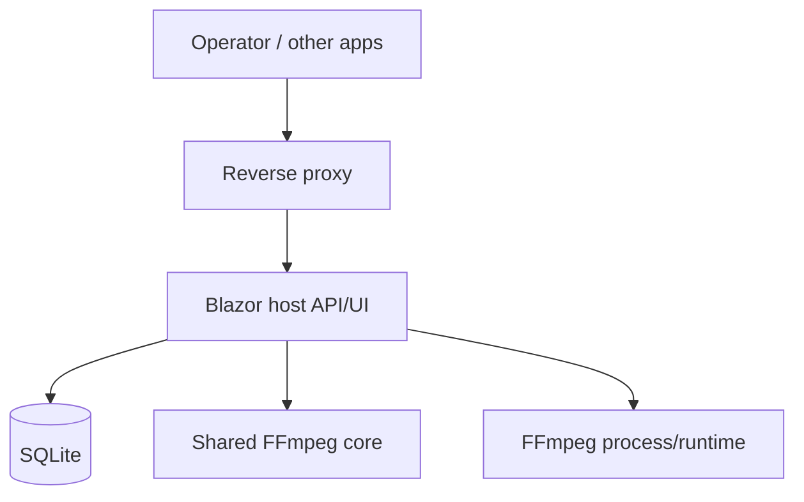

# Core.ffmpeg deployment plan

## Direction
Use the existing Blazor host as the API/UI surface, backed by the shared FFmpeg core, and containerize it for the NAS.

## Recommended split

### 1. Host container
- ASP.NET Core + Blazor Web App
- exposes the operator UI and HTTP API
- owns job submission, status, presets, and history
- talks to the DB
- invokes the shared core for command generation and execution

### 2. FFmpeg worker/runtime
- can live in the same container initially
- can later be split into a separate worker container if job execution needs isolation or horizontal scaling
- runs the process runner and probe commands

### 3. Database
- start with SQLite for V1
- move to PostgreSQL if multi-instance or heavier state management is needed
- store jobs, job runs, presets, and app configuration

### 4. Reverse proxy
- expose the host through Caddy or Traefik
- terminate TLS at the proxy
- keep privileged control routes behind auth

## Minimal V1 deployment

## Suggested rollout

### Phase 1
- keep the host and runtime together
- persist jobs/presets/history in SQLite
- expose /api/status and job-control endpoints
- expose /api/health for container and proxy checks

### Phase 2
- split execution into a worker container if needed
- queue jobs instead of running inline
- keep the host as the control plane

### Phase 3
- move to PostgreSQL if the state grows
- add authentication and role-based access
- add integration endpoints for other apps/NAS workflows

## Practical next step
Implement a small data layer for:
- jobs
- job runs
- presets
- configuration

Then wire the host to use that instead of the current in-memory state.

## Current deployment checks
- Dockerfile healthcheck points at `/api/health`
- docker-compose healthcheck points at `/api/health`
- Operator routes use a basic-auth gate driven by `FFMPEG_HOST_OPERATOR_USERNAME` and `FFMPEG_HOST_OPERATOR_PASSWORD`
- Reverse-proxy deployment guidance lives in `docker-compose.proxy.yml` and `Caddyfile`

## Configuration guidance
- Keep `FFMPEG_HOST_DATA_PATH` on durable storage.
- Treat operator credentials as secrets and rotate them with deployment changes.
- Use `DISABLE_HTTPS_REDIRECT=true` only when TLS terminates at the reverse proxy.
